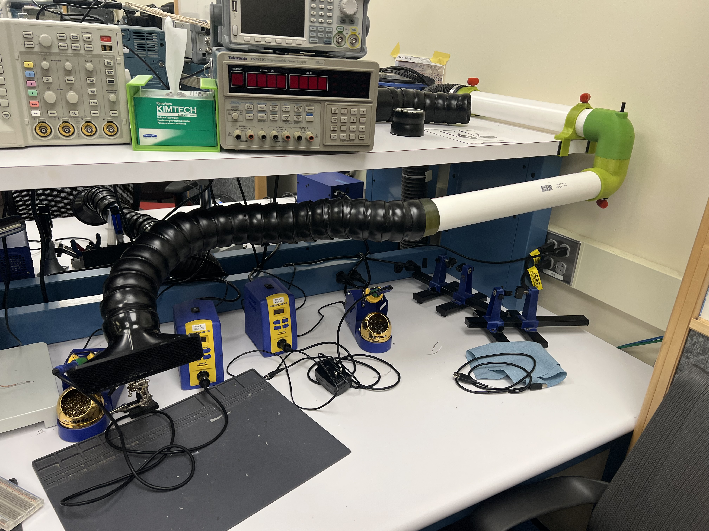
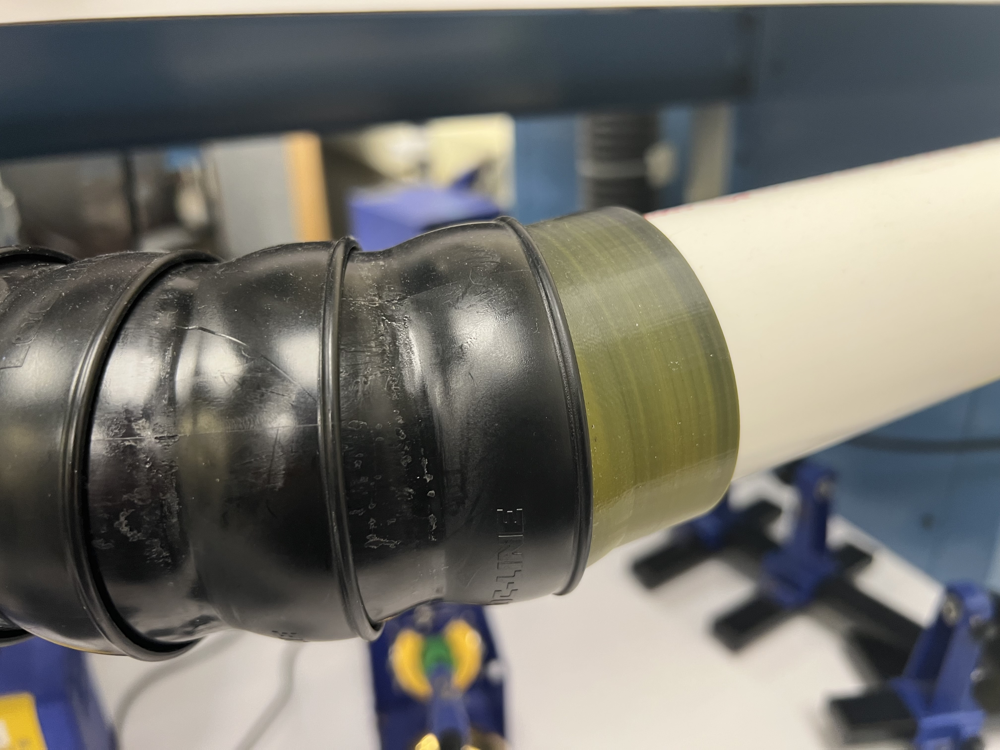
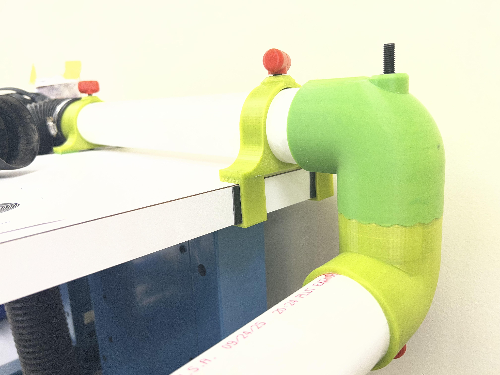
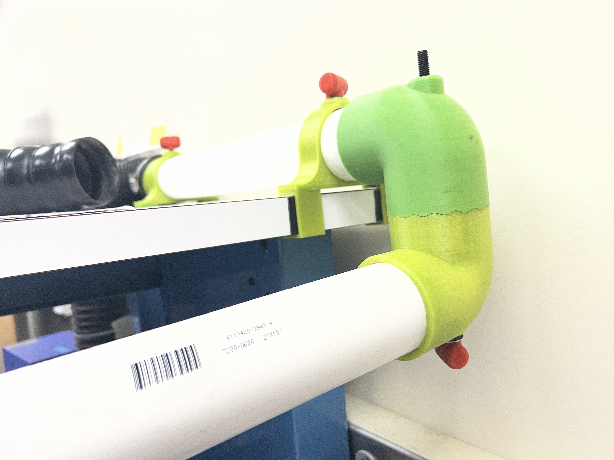
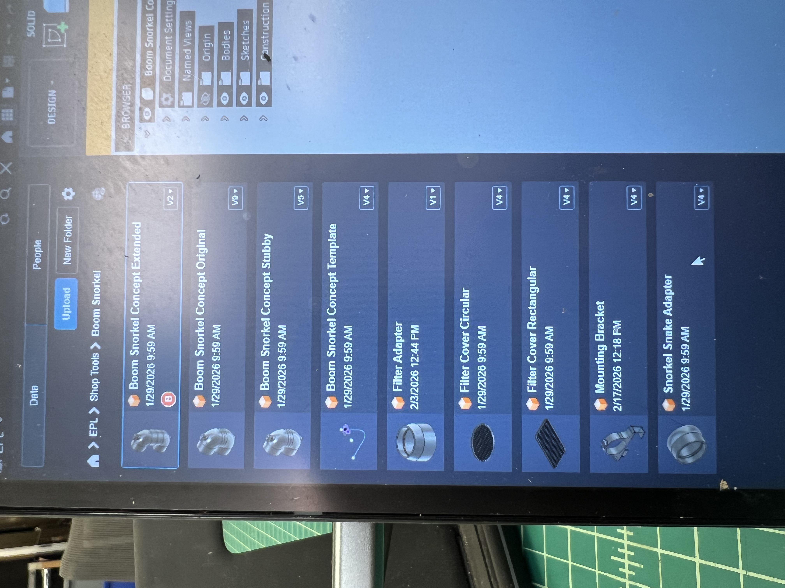
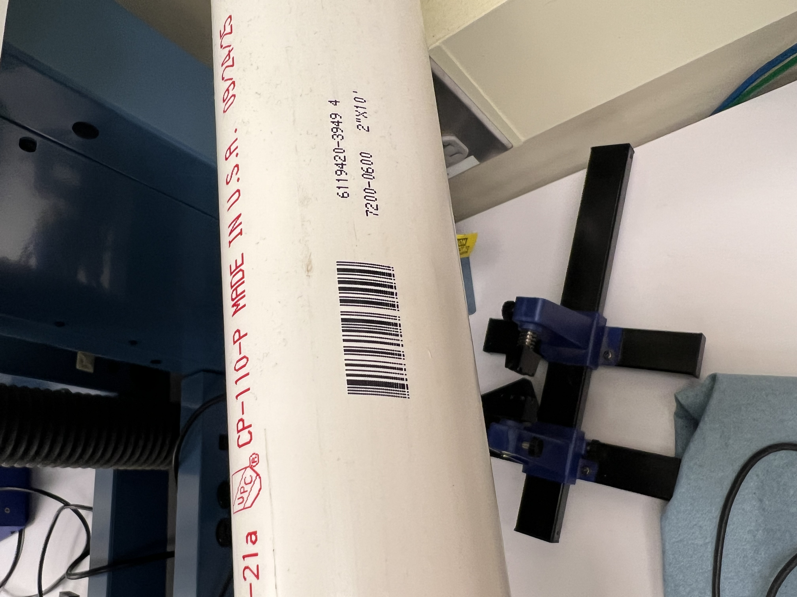

# Boom Snorkel

Open source 3D printed articulating fume extraction arm. Mounts to a bench T-slot rail and positions the intake snout over your work area. Fully repositionable -- loosen the knob, move it, retighten.

## How it works

An M8 threaded rod runs through the joints. The 3D printed joints have wave-face (serrated) mating surfaces. When the knob is loose, joints rotate freely. Tighten the knob and the wave faces mesh together, locking every joint in position simultaneously.

A small PVC or 3D printed alignment ring sits between each joint to keep the wave faces aligned. This stops the joint from drifting side to side when rotating and ensures the waves lock cleanly every time.

The black flexible snake tube from the original fume extractor attaches via a tapered press-fit adapter, so you keep the original intake nozzle.

## Bill of materials

| Part | Spec | Notes |
|---|---|---|
| PVC pipe | 2" Schedule 40 (e.g. 7200-0600) | Cut to desired segment lengths |
| M8 threaded rod | Cut to total arm length | One per arm |
| 13x13x4mm square nuts | x2 per bolt | Superglued together as bolt head (see below) |
| M8 washers | As needed | Under each nut stack and knob |
| Super glue | -- | Bonds the two-nut bolt head |
| 3D printed knob nuts | Red, square 13x13mm pocket | See prints |
| 3D printed joints | Wave-face locking surfaces | See prints |
| 3D printed alignment rings | Or cut from PVC | One between each joint pair |
| 3D printed snake adapter | Tapered press-fit | See prints |
| 3D printed filter adapter | -- | See prints |

## Bolt assembly

Cut M8 rod to length. Superglue two 13x13x4mm square nuts together and thread onto one end -- tighten them against each other (jam nuts) before the glue sets. This double-nut stack slides into the square pocket of the 3D printed knob so the nut doesn't spin when you turn it. Cap the other end with a washer and nut.

## Prints

| File | Description |
|---|---|
| `joint.stl` | Articulating joint with wave-face locking surfaces |
| `alignment_ring.stl` | Ring between joints to prevent side-to-side drift |
| `snake_adapter.stl` | Tapered adapter for standard flexible fume extractor snake tube |
| `filter_adapter.stl` | Adapter for filter end |
| `knob_nut.stl` | Red knob with 13x13mm square nut pocket |

Concept variants:
- **Original** -- baseline joint design
- **Extended** -- longer arm reach
- **Stubby** -- shorter segment for tight spaces
- **Template** -- bare template for new variants

## Assembly

1. Cut 2" Schedule 40 PVC to desired segment lengths
2. Assemble bolt heads (superglue two square nuts, jam together)
3. Thread M8 rod through joints and alignment rings with washers
4. Clip mounting bracket onto bench T-slot rail
5. Press snake adapter onto intake end, attach snake tube
6. Hand-tighten knob to desired stiffness
7. Loosen to reposition, retighten to lock

## Fusion 360 project

## PVC spec

2" Schedule 40 PVC, part number 7200-0600.

## License

CERN Open Hardware Licence v2 - Strongly Reciprocal (CERN-OHL-S-2.0)
